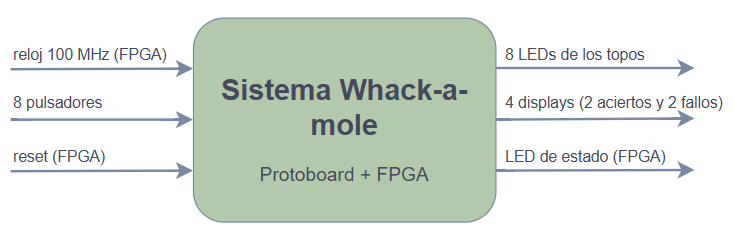
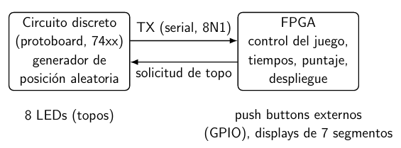
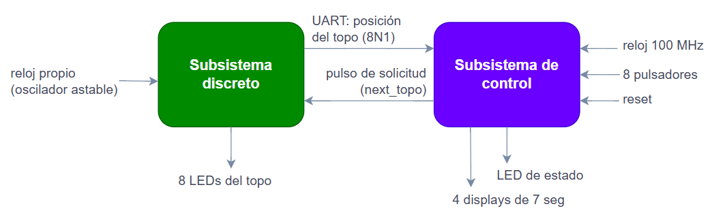
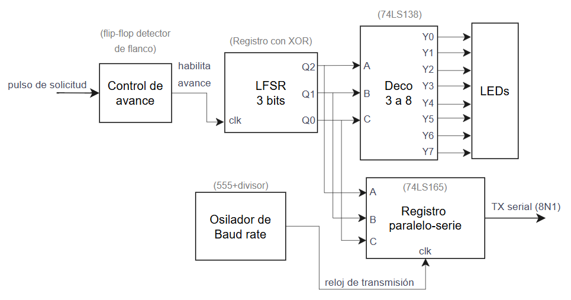
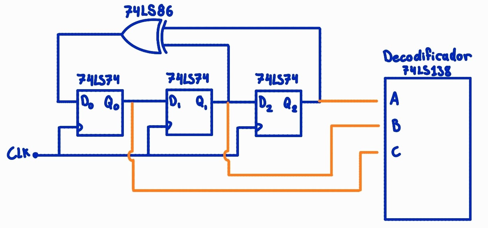
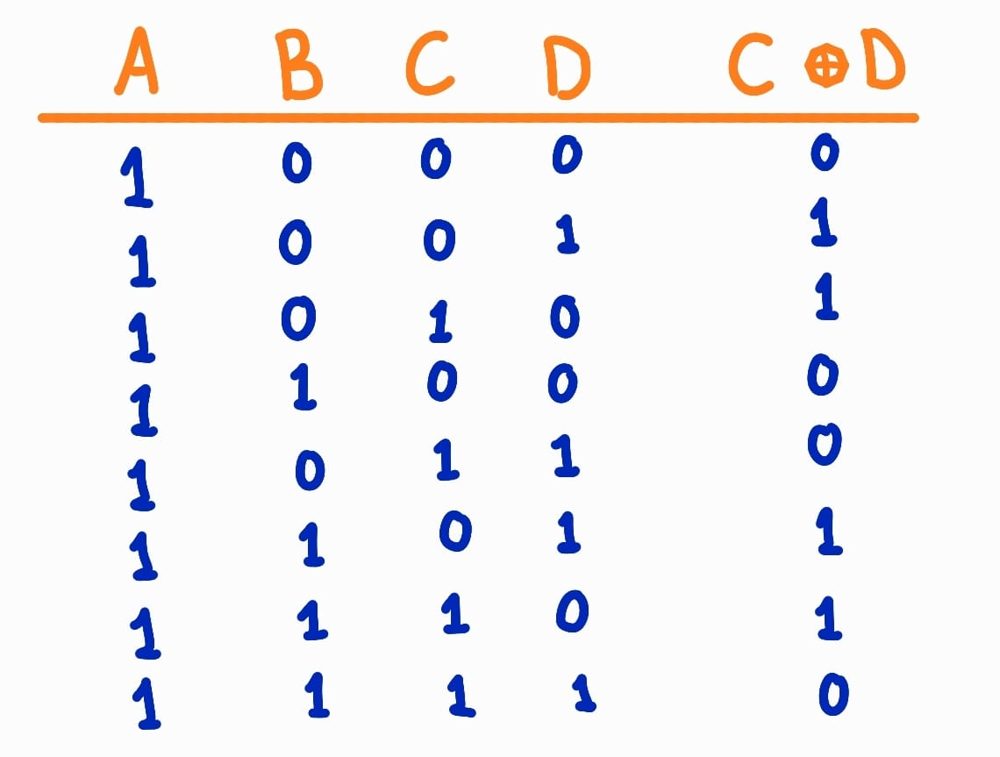
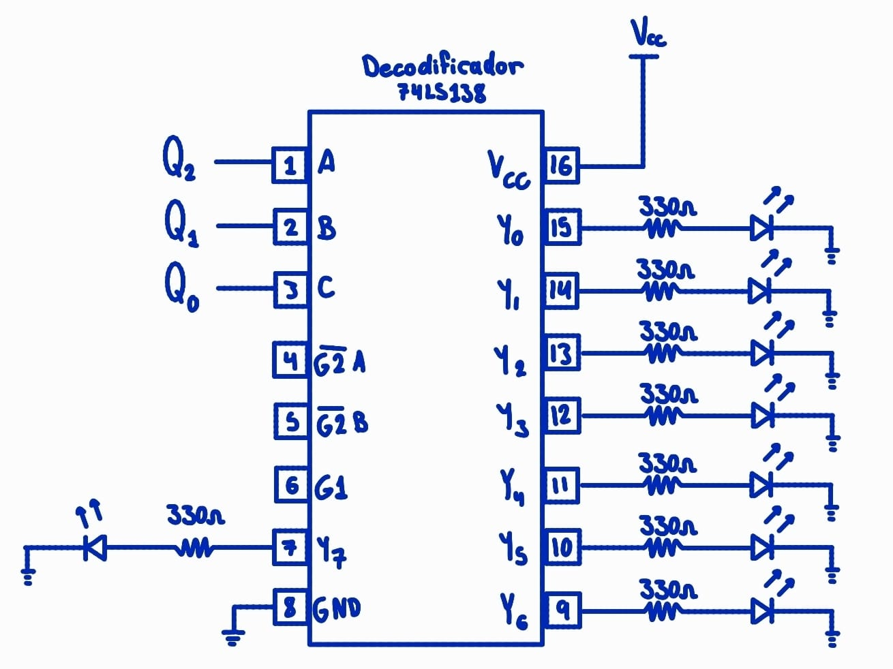
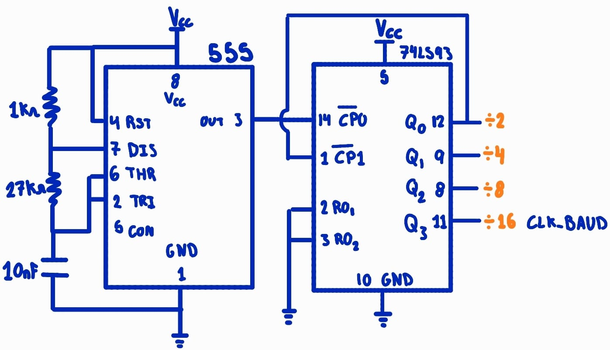
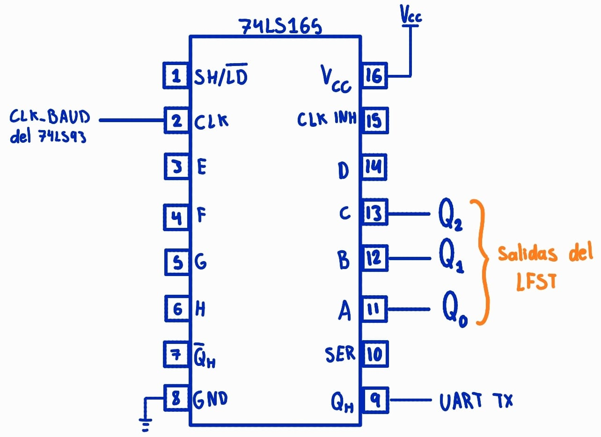
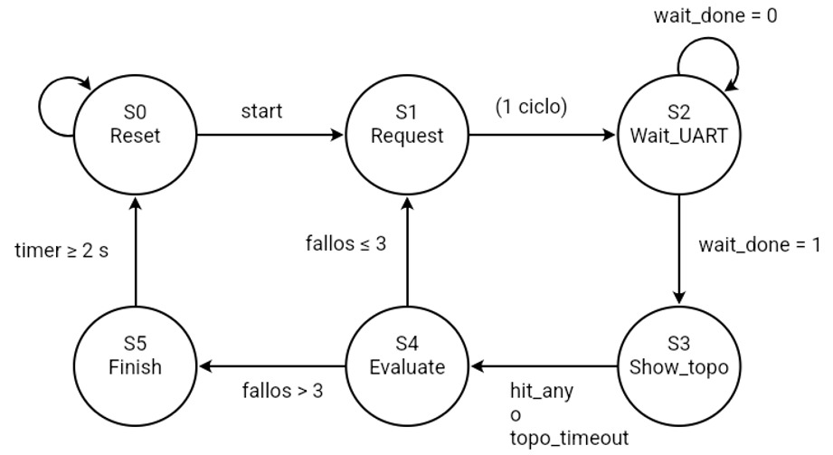

# Proyecto1-TallerDigital
Proyecto 1: Whack-a-mole: juego híbrido FPGA / lógica discreta

## 1. Introducción
El proyecto consiste en el diseño e implementación de una versión del juego Whack-a-mole, en la cual el jugador debe presionar el botón correspondiente a la posición del topo antes de que finalice el tiempo disponible. El sistema se desarrolla como una solución híbrida, combinando un subsistema de lógica discreta implementado en protoboard con un subsistema de control implementado en FPGA.

El circuito discreto se encarga de generar pseudoaleatoriamente la posición del topo, mostrarla mediante LEDs y transmitir dicha posición a la FPGA mediante un enlace serial. Por su parte, la FPGA controla la dinámica del juego, incluyendo los turnos, tiempos, aciertos, fallos, dificultad progresiva y despliegue de resultados.

## 2. Objetivos
Diseñar e implementar un sistema híbrido para el juego Whack-a-mole, integrando un subsistema de lógica discreta en protoboard y un subsistema de control implementado en FPGA, comunicados mediante un enlace serial.

- Diseñar el subsistema discreto encargado de generar y mostrar la posición pseudoaleatoria del topo.
- Diseñar la comunicación serial entre el circuito discreto y la FPGA.
- Diseñar en SystemVerilog la lógica de control del juego mediante una máquina de estados.
- Implementar el control de turnos, tiempos, aciertos, fallos y dificultad progresiva.
- Implementar el conteo y despliegue de aciertos y fallos mediante los displays de 7 segmentos.
- Integrar los subsistemas discreto y FPGA y verificar su funcionamiento mediante pruebas y simulaciones.

## 3. Diseño modular

### 3.1 Diagrama de primer nivel

**Objetivo**: Implementar un sistema híbrido que gestione el funcionamiento completo del juego Whack-a-mole, integrando un circuito de lógica discreta y una FPGA.

**Entradas**
- `clk` : Reloj de la FPGA (100 MHz).
- `rst` : Reinicio manual del juego, boton central de la tarjeta de FPGA.
- `buttons[7:0]` : Botones utilizados por el jugador para golpear el topo.

**Salidas**
- `led_topo[7:0]` : Indica la posición del topo activo.
- display_aciertos : Muestra los aciertos acumulados.
- display_fallos : Muestra los fallos acumulados.
- `led_estado` : Indica si la partida está activa o finalizada, led de la tarjeta.

### 3.2 Diagrama de segundo nivel
En el enunciado se presentó el siguiente diagrama de la arquitectura general para el proyecto de referencia. 

El diagrama de segundo nivel sería el mismo con entradas y salidas (del diagrama anterior) para cada subsistema:

### 3.3 Diagrama de tercer nivel

En esta sección se diseñaron las primeras versiones de los bloques funcionales. 

Para el subsistema discreto:

### 3.4 Diagrama de cuarto nivel

#### 3.4.1 Diseños de esquemático para el subsistema discreto Control de Avance

Este bloque recibe la señal de solicitud proveniente de la FPGA y genera una señal de habilitación para el avance del LFSR. La red RC junto con la lógica combinacional permite generar una transición controlada, reduciendo la posibilidad de múltiples avances no deseados ante una misma solicitud.

Aunque la FPGA podría generar directamente un pulso de avance, este bloque añade una etapa de acondicionamiento de la señal y garantiza que el registro pseudoaleatorio avance una única vez por cada solicitud de nuevo topo.

#### 3.4.2 Diseños de esquemático para el subsistema discreto LFSR

El generador de números pseudoaleatorios se implementa mediante un LFSR (Linear Feedback Shift Register) de 4 bits con una red de realimentación XOR. En el diseño propuesto, la función de realimentación utilizada corresponde a C XOR D, la cual genera el nuevo bit que será introducido en el registro durante cada avance.

La implementación propuesta utiliza flip-flops tipo D de la familia 74LS74 y una compuerta XOR para generar la señal de realimentación del registro. Esta configuración fue seleccionada porque utiliza lógica discreta y permite generar secuencias pseudoaleatorias con una cantidad reducida de componentes.

Las salidas Q0, Q1, Q2 y Q3 corresponden al valor generado por el LFSR. Aunque el registro genera una secuencia de 4 bits, únicamente tres de sus salidas son utilizadas por el decodificador 74LS138, ya que éste requiere una entrada de 3 bits para seleccionar una de las ocho posiciones posibles del topo. El registro avanza únicamente cuando recibe una solicitud de nuevo topo desde la FPGA.

La siguiente tabla muestra los posibles valores de la función de realimentación XOR utilizada por el LFSR para generar el siguiente estado del registro.

#### 3.4.3 Diseños de esquemático para el subsistema discreto Decodificador 3 a 8

El decodificador 74LS138 permite convertir los 3 bits generados por el LFSR en una única salida activa entre ocho posibles. De esta manera, cada valor generado enciende un único LED, indicando visualmente la posición actual del topo para el jugador

#### 3.4.4 Diseños de esquemático para el subsistema discreto Oscilador de Baud Rate

El bloque generador de baud rate se implementa mediante un temporizador NE555 en configuración astable, el cual opera como oscilador maestro alimentando a un contador binario 74LS93 que actúa como divisor de frecuencia. La señal de oscilación principal entra por el pin 14 y se conecta la salida, pin 12, a la entrada de reloj, pin 1, configurando el integrado en modo contador binario completo de 4 bits ($\div 16$).

Las entradas de reinicio ($\text{R0}_1$ y $\text{R0}_2$) se conectan a tierra para garantizar el conteo continuo de 0 a 15. La salida obtenida en el pin 11 proporciona la frecuencia dividida entre 16, generando la señal CLK_BAUD, la cual se utiliza como reloj de desplazamiento para el registro paralelo-serie 74LS165 durante el proceso de transmisión de datos hacia la FPGA.

 #### 3.4.5 Diseños de esquemático para el subsistema discreto Registro Paralelo a Serie

El 74LS165 se utiliza para convertir el dato paralelo de 8 bits proveniente del LFSR en una señal serial compatible con la transmisión UART. El registro permite cargar simultáneamente los bits de la posición y desplazarlos uno a uno mediante CLK_BAUD. La señal serial resultante se obtiene en el pin 9 (QH), desde donde se conecta al bloque de transmisión UART.

#### 3.4.6 Diseños de módulos en la FPGA

La máquina de estado de moore:

